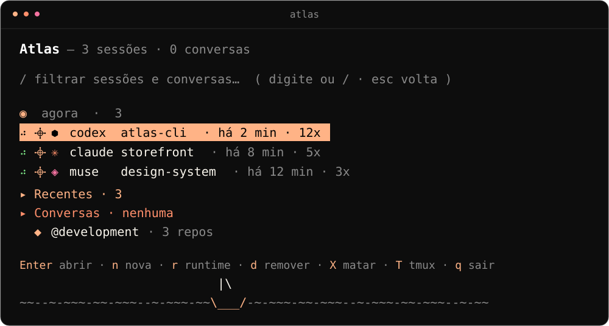

# Atlas

[](https://github.com/DEVxEAZY/Atlas/actions/workflows/ci.yml)
[](LICENSE)
[](https://bun.sh)

Atlas is a terminal session manager for coding agents. Pick a directory,
pick a runtime (Codex, Claude, Muse, or a plain shell), and Atlas opens it
inside tmux — then lets you find, enter, peek at, and kill every session
from one place, in any terminal.



> The TUI speaks Brazilian Portuguese. This document is in English.

## Features

- **One launcher** for Codex, Claude, Muse, and shell, per directory.
- **Recents with history** — reopen anything with `Enter`; live sessions pin
  to the top with an animated indicator.
- **Native conversations** — reads the Claude/Codex/Muse stores and resumes
  conversations in their original runtime.
- **tmux-backed sessions** — every launch runs as `atlas-<dir>-<runtime>-<hash>`.
  From any other terminal, Atlas lists it (marked `𖥠`), shows a read-only
  pane preview, attaches to it, or kills it. Attach uses `exec` (same PID),
  so the client is never orphaned; nested runs use `switch-client`.
- **Unmanaged tmux section** — orphaned `atlas-*` sessions plus foreign
  sessions with an agent in a pane show up as `◈ sessões tmux`, with the
  same view/attach/kill gestures. Idle foreign shells stay out of the way.
- **Safe kills** — destructive keys arm on first press and act on second;
  removing a running session from history is refused with guidance.
- **Single binary** — `bun build --compile`, no venv, no runtime to install.

## Quickstart

Prerequisites: [Bun](https://bun.sh) and [tmux](https://github.com/tmux/tmux).

```sh
git clone https://github.com/DEVxEAZY/Atlas.git
cd Atlas/cli-node
bun install
bun run build                  # produces dist/atlas (~100MB, standalone)
install dist/atlas ~/.local/bin/atlas
atlas                          # open the TUI
```

## Using it

| Screen | Keys |
|---|---|
| Hub | `Enter` expand/open/resume · `←→` collapse/expand · `n` new · `r` runtime · `d` remove (refused while running) · `X` twice to kill the row · `/` filter · `q` quit · type to filter |
| Running session (tmux 𖥠) | `Enter` attach · `r` refresh pane preview · `esc` back · `X` twice to end the session · `↑↓` scroll |
| Running session (external) | `esc` back without touching the process · `X` twice to really end it · `↑↓` scroll the log |
| Domain / New session | type to filter or paste a path · `Enter` confirm · `esc` back |
| Runtime | `↑↓` move · `Enter` pick (pre-selects the directory's last runtime) · `esc` back |

`ctrl+c` quits from anywhere. Recents shows the last 10; the filter searches
all of history. For a deliberate second instance in one directory use `n`
(New session) — `Enter` on a list never duplicates.

Without the TUI:

```sh
atlas --list
atlas --dir ~/repo --runtime codex
atlas --dir ~/repo --runtime claude --print   # show the tmux plan only
```

Inside an attached session, `prefix + d` (`Ctrl-b d`) detaches without
killing. Without tmux installed, sessions open directly in the terminal
(with no cross-terminal management).

## Configuration

| Setting | Default |
|---|---|
| History file | `~/.local/share/atlas/history.json` |
| `ATLAS_ROOTS` | `~/@development:~/@megavale-repos` (`:`-separated scan roots) |
| `ATLAS_HISTORY_FILE` | override for the history path |
| `ATLAS_TMUX_BIN` | override for the tmux binary (default: `PATH` lookup) |

## Repository layout

| Path | What |
|---|---|
| `cli-node/` | The maintained tool (Bun + TypeScript + Ink). See [cli-node/README.md](cli-node/README.md). |
| `cli/` | Original Python prototype, kept for reference. Superseded by `cli-node/`. |
| `docs/` | Product notes. |

## Development

```sh
cd cli-node
bun install
bun run atlas      # run the TUI from source
bun test tests/    # 123 tests
```

CI runs install, tests, and the compiled build on every push to `main` and
every pull request.

## License

MIT — see [LICENSE](LICENSE).
