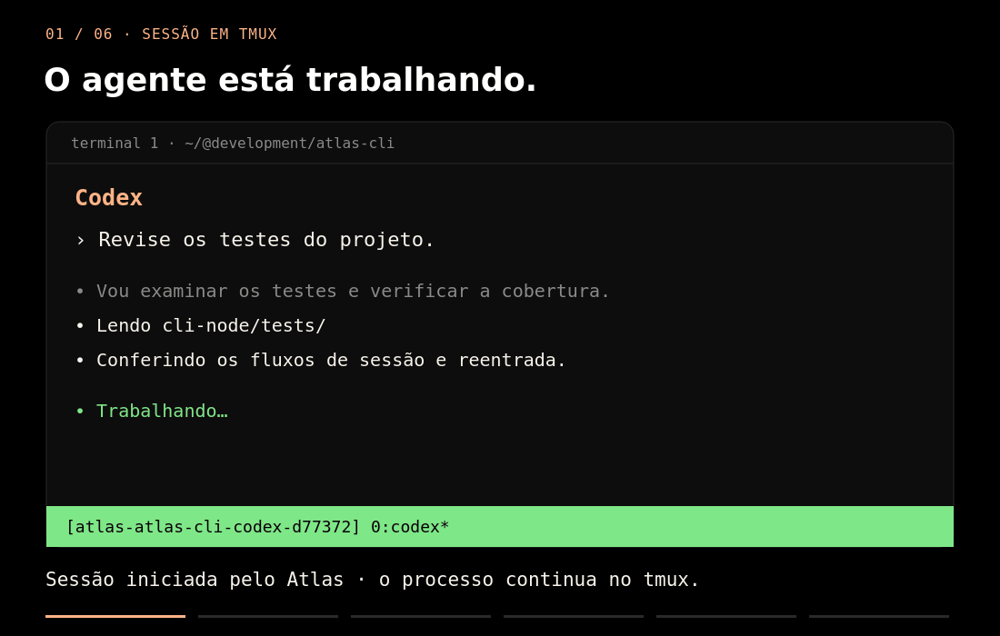

# Atlas CLI

[](https://www.npmjs.com/package/@devxeazy/atlas-cli)
[](https://github.com/DEVxEAZY/atlas-cli/actions/workflows/ci.yml)
[](https://github.com/DEVxEAZY/atlas-cli/releases/latest)
[](LICENSE)


## Every coding-agent session. One terminal hub.

Find, preview, and re-enter your Codex, Claude, Muse, and shell sessions on the
same machine. Atlas is a Linux terminal UI backed by tmux. The TUI is pt-BR;
documentation is English.



*22-second illustrative demo, reconstructed from the TUI; not a live recording.
[Static screenshot](docs/atlas-hub.svg) · [How the visuals were made](docs/demo/README.md)*

- **Pick up where you left off.** Find running sessions and native agent conversations in one hub.
- **Move between terminals.** Detach, preview output, and attach to the same tmux session on the same machine.
- **Start in the right project.** Choose a directory and runtime, or paste a path; Atlas remembers your recent sessions.

## Install

Linux x86_64 and arm64 are supported. The release binary includes Bun; no
separate language runtime is needed. Install [tmux](https://github.com/tmux/tmux)
for persistent sessions and cross-terminal management. Without tmux, Atlas
can launch directly in the current terminal.

For coding-agent sessions, install and authenticate Codex, Claude, or Muse
separately and make its command available on `PATH`. You can try Atlas with
a plain shell first.

With [Bun](https://bun.sh) 1.4.2 or newer on `PATH`, install from npm:

```sh
bun add -g @devxeazy/atlas-cli    # or: npm install -g @devxeazy/atlas-cli
atlas --help
```

The npm package runs on Bun, not Node; `npm install` works only when `bun`
is on `PATH`. Without Bun, use the standalone binary below.

**WSL:** install inside the Linux distribution, not from Windows. If
`npm install` fails with `EBADPLATFORM … current: {"os":"win32"}`, WSL
resolved the Windows `npm` (`which npm` shows `/mnt/c/…`). Install Bun and
tmux inside WSL, then `bun add -g @devxeazy/atlas-cli`.

Or download a standalone binary (Bun included) from the [latest release](https://github.com/DEVxEAZY/atlas-cli/releases/latest):

| Linux architecture (`uname -m`) | Archive | Checksum |
| --- | --- | --- |
| `x86_64` | [atlas-linux-x64.tar.gz](https://github.com/DEVxEAZY/atlas-cli/releases/latest/download/atlas-linux-x64.tar.gz) | [SHA-256](https://github.com/DEVxEAZY/atlas-cli/releases/latest/download/atlas-linux-x64.tar.gz.sha256) |
| `aarch64` / `arm64` | [atlas-linux-arm64.tar.gz](https://github.com/DEVxEAZY/atlas-cli/releases/latest/download/atlas-linux-arm64.tar.gz) | [SHA-256](https://github.com/DEVxEAZY/atlas-cli/releases/latest/download/atlas-linux-arm64.tar.gz.sha256) |

For x86_64, run the following. On arm64, replace `atlas-linux-x64` with
`atlas-linux-arm64` on the first line. Downloads stay in a temporary directory.

```sh
atlas_asset=atlas-linux-x64
(
  atlas_download_dir=$(mktemp -d) &&
  cd "$atlas_download_dir" &&
  curl -fLO "https://github.com/DEVxEAZY/atlas-cli/releases/latest/download/$atlas_asset.tar.gz" &&
  curl -fLO "https://github.com/DEVxEAZY/atlas-cli/releases/latest/download/$atlas_asset.tar.gz.sha256" &&
  sha256sum --check "$atlas_asset.tar.gz.sha256" &&
  tar -xzf "$atlas_asset.tar.gz" &&
  mkdir -p "$HOME/.local/bin" &&
  install -m 0755 "$atlas_asset" "$HOME/.local/bin/atlas"
) && export PATH="$HOME/.local/bin:$PATH" && atlas --help
```

If needed, add that `PATH` export to your shell startup file.
[Release notes](https://github.com/DEVxEAZY/atlas-cli/releases) include platform details.

## First run

```sh
atlas
```

Press `n`, paste an existing project path, press `Enter`, then select a
runtime. Choose **Terminal** to try a shell without an agent account.
With tmux installed, detach using `Ctrl-b`, then `d`. Open `atlas` in
another terminal, select the running session, press `Enter` to preview it,
then `Enter` again to attach.

The interface is **Brazilian Portuguese (pt-BR)**: `agora` means running now,
`Recentes` means recent sessions, and `Conversas` means conversations. The
[UI glossary](docs/ui-glossary.md) covers every key label.

To discover projects automatically, set your own scan roots:

```sh
export ATLAS_ROOTS="$HOME/projects:$HOME/work"
atlas
```

Any existing directory can also be pasted into the picker without configuring
roots. The default roots are `~/@development` and `~/@megavale-repos`.

## Everyday use

| Action | Keys |
| --- | --- |
| Navigate / open / resume | Arrow keys / `Enter` |
| New session / filter | `n` / `/` |
| Preview a running tmux session / attach | `Enter` / `Enter` again |
| Leave a preview / quit Atlas | `Esc` / `Ctrl-c` |
| End the selected running session | `X`, then `X` again to confirm |
| Move a session or conversation into tmux, from the Hub or its management view | `T`, then `T` again |
| Back to Atlas from a tmux session, leaving it running | `Ctrl-b`, then `d` (default tmux prefix); `Ctrl-b L` when Atlas runs inside tmux |

Sessions you open from the Atlas TUI come back to it. Detach with `Ctrl-b d`
and you are back in the Hub while the session keeps running, so you can open
another one. When Atlas itself runs inside tmux, it switches you to the
session and stays in its own pane: `Ctrl-b L` returns to it. `atlas DIR`
without the TUI still hands the terminal over and exits.

For a deliberate second session in the same directory, use `n`. Opening a
running row shows its management view. Ending a session stops its work;
detaching leaves it running.

Migration stops the external process and resumes its conversation in a
detached tmux session; an idle conversation simply opens there in the
background. It works from conversation and history rows; history
rows need one unambiguous resume ID. Atlas refuses unsupported or ambiguous
migrations with guidance.

To go straight back to a project's session, run `atlas` with its directory.
Atlas attaches to that directory's live tmux session, otherwise shows the
running agent's management view, otherwise starts the runtime you last used
there, and only asks for a runtime when there is no history:

```sh
cd "$HOME/projects/my-app" && atlas .
atlas --list
atlas --dir "$HOME/projects/my-app" --runtime codex
atlas --dir "$HOME/projects/my-app" --runtime shell --print
```

`--print` shows the launch or attach command without running it.

## Scheduled tasks

A scheduled task is a prompt that Claude, Codex or a shell command runs on
its own in a directory, on a schedule, like Claude Code's `/schedule`. Ask
your agent ("todo dia às 9h, revise os PRs abertos") or file it yourself:

```sh
atlas cron skill --install   # teaches Claude Code (and Codex) the atlas-cron skill
atlas cron add --when "dias úteis 09:00" "Revise os PRs abertos e resuma em REVIEW.md"
```

`add` only files a proposal. It runs once you install it in Atlas: press `C`
in the Hub, then `Enter` on the task. On that screen, `p` pauses a task,
`R` runs it now, `x` twice deletes it, and `S` installs the skill.

Schedules can be written as `a cada 30 min`, `a cada 2 h`, `todo dia 09:00`,
`dias úteis 18:30`, `toda segunda 08:00`, `@daily` or any 5-field cron
expression. They use the machine's timezone. The user crontab does the
scheduling, and Atlas owns only the lines it marks `# atlas-cron:`. Each run
is headless: `claude -p --permission-mode acceptEdits`, or
`codex exec --sandbox workspace-write`. It never inherits a permissive
global mode. Output goes to `~/.local/state/atlas/cron/<id>.log`, which you
can read with `atlas cron log <id>`.

## Local data and privacy

Atlas stores session history at `~/.local/share/atlas/history.json` and reads
local Claude, Codex, and Muse conversation stores to list and resume them.
Previews may display conversation text, terminal output, and local paths.
Use `ATLAS_HISTORY_FILE` to select another history file. Scheduled tasks
live in `~/.local/share/atlas/cron/`.

Atlas does not upload your data, run an Atlas daemon, or require an Atlas
cloud account. Agent CLIs retain their own authentication, network behavior,
and data policies. Avoid sharing screenshots or logs containing secrets.

## How it works and limitations

The maintained implementation is [Bun + TypeScript + Ink](cli-node/README.md).
Atlas discovers real directories, reads local history and native conversation
stores, and launches installed runtimes. tmux owns persistent sessions;
Atlas captures pane output for previews and hands the terminal to tmux when
you attach. `ATLAS_TMUX_BIN` can override tmux discovery on `PATH` (set it
empty to force direct launch); `ATLAS_NO_BOAT=1` turns the footer painting
off for good. The painting (a moonlit sky over a restless sea where the
little boat `ོ𓂃𖠳𓂃` sails, and now and then an octopus swims by) starts
hidden; `A` in the Hub shows it or hides it again, and Atlas remembers the
choice.

`ATLAS_GLYPHS=safe` swaps Atlas's symbols for portable ones (ASCII plus
the WGL4 symbols every Windows console font has), for terminals whose fonts
lack them, such as some Git Bash or Windows setups.

Atlas-created tmux sessions use
`atlas-<dir>-<runtime>-<hash>[-r<resume>][-N]`. Foreign tmux sessions linked
to a history row or live conversation mark that row `𖥠` instead of appearing
twice. Unlinked agent sessions and orphaned `atlas-*` sessions appear under
`◈ sessões tmux`; idle foreign shells are omitted. Atlas turns mouse mode on
for every session it creates or enters, so wheel scroll works; the
server-wide default stays untouched.

- Linux is the supported platform; macOS and Windows binaries are not provided.
- Cross-terminal session management requires tmux. Direct launch remains available without it.
- Native conversation discovery depends on agent storage formats and may need updates as those CLIs change. Not every arbitrary process is discoverable.
- Atlas manages the machine where it runs, including an already-remote shell. It does not connect over SSH, synchronize machines, or orchestrate agents in the cloud.
- The TUI is currently pt-BR only. English documentation does not imply an English interface.

The original Python prototype in `cli/` is retained for reference; development
targets `cli-node/`.

## Build from source

Install [Bun](https://bun.sh) (release builds use 1.4.2), then:

```sh
git clone https://github.com/DEVxEAZY/atlas-cli.git
cd atlas-cli/cli-node
bun install --frozen-lockfile
bun run build
mkdir -p "$HOME/.local/bin"
install -m 0755 dist/atlas "$HOME/.local/bin/atlas"
export PATH="$HOME/.local/bin:$PATH"
atlas
```

## Help and contribute

Try the detach → preview → re-enter flow and tell us where it breaks or feels
unclear. [Support](SUPPORT.md) explains where to ask questions or report bugs.
See [Contributing](CONTRIBUTING.md), the [roadmap](ROADMAP.md), and our
[Code of Conduct](CODE_OF_CONDUCT.md). Report vulnerabilities privately using
the [security policy](SECURITY.md).

## License

[MIT](LICENSE).
